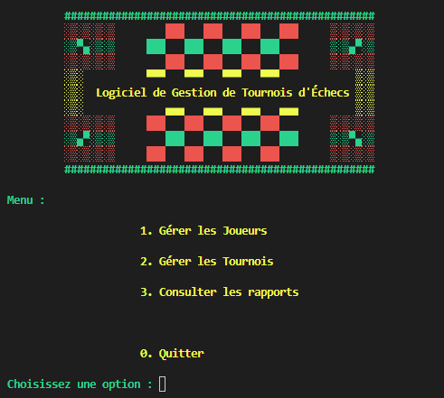

# 
<bold>Chess Tour Operator - OCR_Mission[3]</bold>

=========================================================================

   
  <picture> 
    
  </picture>
   
   

### 
- Logiciel de Gestion de Tournois d'Échecs -

# 
 I. Description du Projet

Ce gestionnaire de tournois d'échecs est une application Python autonome et hors ligne conçue pour la gestion des joueurs, des tournois et des résultats. L'application utilise des fichiers JSON pour la persistance des données et propose divers rapports et fonctionnalités.
Elle est mon premier programme en Programmation Orientée Objet, et mon premier programme aussi qui utilise un design pattern (MVC). 

# 
 II. Fonctionnalités Principales

**Gestion des Joueurs**: Ajoutez de nouveaux joueurs et affichez les données des joueurs tels que le nom, le prénom, la date de naissance et l'identifiant national d’échecs.

**Tournois**: Créez, gérez et suivez plusieurs tournois avec un nombre spécifié de tours. Chaque tour est une liste de matchs entre les joueurs inscrits, générés dynamiquement en fonction des résultats précédents.

**Génération de Paires**: Le système d'appairage, aléatoire pour les premiers rounds et selon les points gagnés lors du tournoi pour les rounds suivants, garantit que chaque tour est équilibré et permet d'éviter au maximum qu'un joueur ne rencontre deux fois le même adversaire.

**Rapports**: Affichez des rapports détaillés, tels que la liste de tous les joueurs par ordre alphabétique, la liste des joueurs d'un tournoi donné par ordre alphabétique, la liste de tous les tournois, la liste des noms et dates des tournois, la liste des rounds et matchs d'un tournoi spécifique.

**Sauvegarde/Chargement des Données**: Les modifications apportées aux données (joueurs et tournois) sont automatiquement sauvegardées dans des fichiers JSON pour éviter toute perte de données. Le programme charge toutes les données à partir des fichiers JSON et peut restaurer son état entre les exécutions. il sauvegarde un tour appairé avec ou sans ses résultats et vous permet de reprendre où vous en êtes.

**Vues**: L'interface utilisateur conviviale, colorée et mise en page permet aux utilisateurs d'effectuer facilement des actions telles que l'ajout de joueurs, la création de tournois, etc... à travers un menu principal catégoriel et des sous-menus fonctionnels.

# 
 III. Structure du Code

Le code est structuré selon le modèle **MVC** (Modèle-Vue-Contrôleur) pour une meilleure organisation et maintenance. Le programme est divisé en trois packages principaux: modèles (entités & managers), vues et contrôleurs. Les instances de classe modèles ont été privilégiées plutôt que la manipulation de dictionnaires pour assurer la conformité avec le modèle MVC.

Ce programme aura aussi été mon premier programme en Programmation Orientée Objet. La souplesse et l'abstraction liée aux classes et objets, mêlées au partage de responsabilités des packages en MVC, auront été une épreuve d'architecture logicielle très pédagogique (sur les bonnes pratiques en MVC, le scope des rôles de "ModelManagers", sur les erreurs à ne pas faire en POO, le "Keep It Simple, Stupid", l'importance de la séparation modulaire, simple et sciemment typée des méthodes, le codage d'algoritme... tout comme m'ont apporté aussi les solutions "mains dans le cabouis" pour faire fonctionner l'ensemble du logiciel malgré quelques mauvais choix de départ, les conséquences d'une vision globale sans architecture précise, ni découpage en tâches/scrum master).

------------------------------------------

## 
I - Setup windows

#### ( si [Git](https://github.com/git-for-windows/git/releases/download/v2.45.0.windows.1/Git-2.45.0-64-bit.exe) et [python 3.6+](https://www.python.org/ftp/python/3.12.3/python-3.12.3-amd64.exe) ne sont pas installés, commencez par l'annexe 1 !)
------------------------------------------
  #### A - Créez un répertoire pour le programme
Lancez votre explorateur windows (WIN+E) 
Créez un répertoire (CTRL+MAJ+N) pour le programme où vous le souhaitez et **nommez-le**
ex. : vous pouvez l'appeler **ChessTourOP** dans d:\chemin\vers\mon\dossier\ChessTourOP
**double-cliquez** sur le répertoire créé pour aller dedans.

  #### B - lancez l'interpréteur de commande windows
Clic gauche dans la barre d'adresse de l'explorateur, écrivez **"cmd"** (à la place de l'adresse)
et appuyez sur **"entrée"** (comme à chaque instruction en ligne future):

	cmd
	
  #### C - clonez le repo Github du projet dans ce répertoire
dans le terminal (l'invite de commande) qui indique bien que vous êtes à l'adresse du dossier créé, écrivez tour à tour:

	git init

puis : 

	git pull https://github.com/AdeVedA/ChessTourOperator--OCR_Mission3 -t main

  #### D - installez un environnement virtuel dans un dossier 'env' du projet, toujours par l'invite de commande :
	
	python -m venv env
 
  #### E - activez l'environnement virtuel créé précédemment :
	
	env\Scripts\activate.bat
 
  #### F - installez les librairies requises :
	
	pip install -r requirements.txt

  #### G - Lancement du programme (l'environnement virtuel doit avoir été activé avant):

	python main.py

  #### H - Créez un rapport pour vérifier la conformité du code à flake8

	flake8 --format=html --htmldir=flake8_rapport

  #### I - Désactivez l'environnement virtuel

	deactivate
-------------------------
-------------------------

## 
II - Setup Linux/Mac

#### ( si **[Git](https://sourceforge.net/projects/git-osx-installer/files/git-2.23.0-intel-universal-mavericks.dmg/download?use_mirror=autoselect)** et **[python](https://www.python.org/ftp/python/3.12.3/python-3.12.3-macos11.pkg)** ne sont pas installés, commencez par l'annexe 1 !)

-------------------------
	
  #### A- lancez un terminal

clic sur loupe/recherche lancez

	terminal
	
  #### B - Créez un répertoire pour le programme et placez-vous dedans
  par exemple si vous souhaitez appeler ce dossier "ChessTourOP" :

	mkdir ChessTourOP

puis :

	cd ChessTourOP

  #### C - clonez le repo Github du projet dans ce répertoire
dans le terminal (l'invite de commande) qui indique bien que vous êtes à l'adresse du dossier créé, écrivez tour à tour:

	git init

puis : 

	git pull https://github.com/AdeVedA/ChessTourOperator--OCR_Mission3 -t main

  #### D - installez un environnement virtuel dans un dossier 'env' du projet, toujours par le terminal :
	
	python3 -m venv env

  #### E - activez l'environnement virtuel créé précédemment :
	
	source env/bin/activate
 
  #### F - installez les librairies requises :
	
	pip install -r requirements.txt

  #### G - Lancement du programme (l'environnement virtuel doit avoir été activé avant):

	python3 main.py

  #### H - Créez un rapport pour vérifier la conformité du code à flake8

	flake8 --format=html --htmldir=flake8_rapport

  #### I - Désactivez l'environnement virtuel

	deactivate
 

## 
III - informations sur la structure de données

les données de vos tournois et joueurs sont toutes sauvegardées en .json dans le répertoire "datas" et le sous-répertoire "tournaments"

	racine_projet/
		├─────datas/
		├	   ├────players_data.json
		├	   └────tournaments/
		├			   ├─────tournament_1.json
		├			   └─────tournament_2.json...
		└─────main.py
		etc...

# 
Annexe 1 - installation de Python & Git

=======================================================================

pour Windows 64bits :
--------------------

installez **[Git](https://github.com/git-for-windows/git/releases/download/v2.45.0.windows.1/Git-2.45.0-64-bit.exe)** 
verifiez en tapant "cmd" dans le menu démarrer puis "git version" dans le terminal

installez **[python](https://www.python.org/ftp/python/3.12.3/python-3.12.3-amd64.exe)** en vous assurant que ***"Add to PATH"*** est coché (laissez les autres choix par défaut)
verifiez en tapant "cmd" dans le menu démarrer puis "python --version" dans le terminal

pour Mac/Linux :
--------------------
**Git**
cliquez sur l'icone de recherche (loupe), écrivez "terminal" (on vérifie si git est déjà présent)

	git version

si ok, passez à python. 
sinon, installez ce qu'il vous propose d'installer ("command line developer tools") puis recommencez "git version" en terminal,
sinon : installez **[Git](https://sourceforge.net/projects/git-osx-installer/files/git-2.23.0-intel-universal-mavericks.dmg/download?use_mirror=autoselect)**
puis revérifiez git version dans le terminal

**Python**
installez **[python](https://www.python.org/ftp/python/3.12.3/python-3.12.3-macos11.pkg)**
